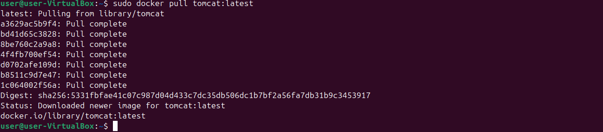
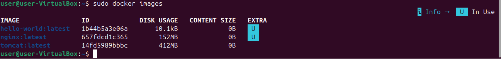
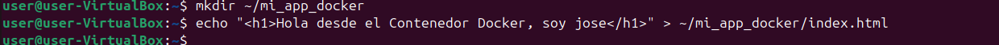
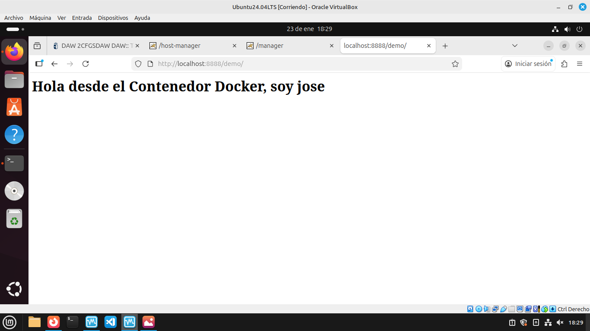

# Tomcat en contenedores (Docker)

### 1. Instalación de Docker
Para comenzar, he actualizado los repositorios del sistema y he procedido a instalar el motor de Docker en la máquina virtual Ubuntu.

**Comandos ejecutados:**
```bash
sudo apt update
sudo apt install docker.io -y
```
### 2. Descarga de la Imagen Oficial de Tomcat
Una vez instalado Docker, he descargado la última imagen oficial de Tomcat desde Docker Hub. Esto garantiza que disponemos de un entorno limpio, actualizado y listo para usar sin necesidad de configurar manualmente el servidor en el host.

**Comando:**
```bash
sudo docker pull tomcat:latest
```

Tras la descarga, verifico que la imagen se encuentra disponible en mi repositorio local de imágenes.




---

### 3. Preparación de la Aplicación y Despliegue
En lugar de usar una aplicación WAR compleja, he creado una estructura de aplicación web sencilla para verificar el montaje. He creado un directorio local y un archivo `index.html` con un mensaje personalizado.

**Pasos realizados:**
* **Creación del directorio:** `mkdir ~/mi_app_docker`
* **Creación del contenido:** `echo "<h1>Hola desde el Contenedor Docker, soy jose</h1>" > ~/mi_app_docker/index.html`

Posteriormente, he arrancado el contenedor mapeando el puerto **8888** del host al **8080** del contenedor y montando mi carpeta local en la ruta de aplicaciones de Tomcat (`/usr/local/tomcat/webapps/demo`).



---

### 4. Verificación del Despliegue
Accedo desde el navegador a la dirección `http://localhost:8888/demo/`. Como se observa en la captura, el contenedor responde correctamente sirviendo el archivo HTML creado anteriormente, confirmando que el montaje de volúmenes y el redireccionamiento de puertos funcionan con éxito.



---

### 5. Diferencias: Tomcat Nativo vs. Tomcat en Contenedor
Tras realizar ambas instalaciones, he identificado las siguientes diferencias clave:

| Característica | Tomcat Nativo (Instalado en VM) | Tomcat en Contenedor (Docker) |
| :--- | :--- | :--- |
| **Instalación** | Requiere instalar Java (JRE/JDK) y configurar variables de entorno manualmente. | No requiere Java en el host; todo viene empaquetado en la imagen. |
| **Aislamiento** | Comparte recursos y dependencias con otros procesos del sistema operativo. | Totalmente aislado. Las dependencias de una app no afectan a otras. |
| **Portabilidad** | Difícil de mover a otro servidor sin repetir toda la configuración. | Se puede ejecutar en cualquier máquina con Docker con el mismo resultado. |
| **Gestión** | Se gestiona con `systemctl` o scripts `.sh` en la carpeta bin. | Se gestiona mediante comandos de ciclo de vida de Docker (`start`, `stop`, `rm`). |
